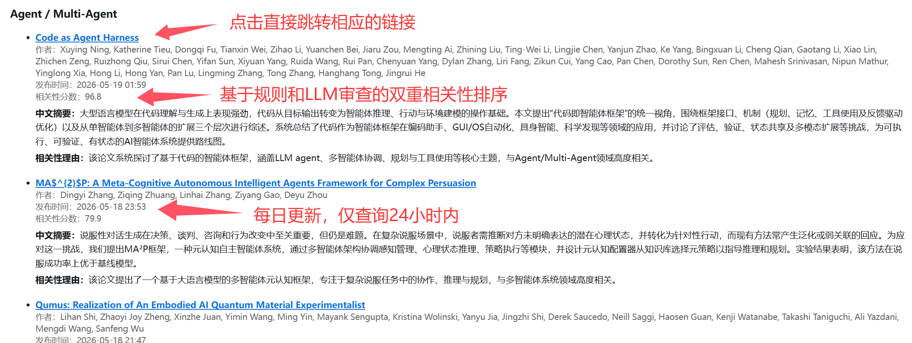
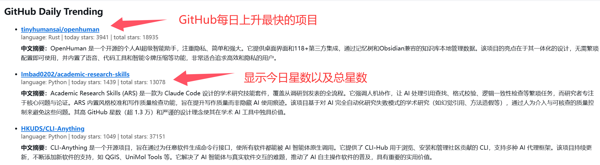

#  AI Research Lightchaser

> 自动抓取 `arXiv`、`GitHub Trending`、`Hugging Face Papers`，  
> 对研究方向做相关性评估，生成中文摘要，并通过邮件发送日报 / 周报。


---

## ✨ 简介

`AI Research Daily Digest` 是一个面向 AI 研究者、工程师和技术爱好者的自动化信息追踪项目。

它的目标不是简单抓网页，而是构建一条完整的信息筛选流水线：

- 自动抓取论文与项目
- 按研究方向评估相关性
- 使用 DeepSeek 生成中文摘要
- 输出为结构清晰的邮件日报 / 周报

---

## 🌟 核心特性

### 📰 多源抓取

当前支持三类数据源：

- `arXiv`
- `GitHub Daily Trending`
- `Hugging Face Papers`

### 🎯 面向研究方向的 arXiv 相关性评估

`arXiv` 不是简单全量抓取，而是：

1. 为每个研究方向单独构建 query
2. 独立抓取候选论文
3. 规则粗筛
4. DeepSeek rerank
5. 输出每个方向最值得看的论文

### 🧾 中文摘要自动生成

项目会对：

- arXiv 论文摘要
- GitHub 项目简介 + README 片段
- Hugging Face 论文摘要 / 页面摘要

统一生成 `4-5 句中文总结`，方便快速阅读。

### ⚙️ 高灵活配置

通过 `config.yaml` 可快速调整：

- 研究方向
- arXiv 每个方向抓取多少篇
- 重排候选数
- 最终展示数
- GitHub 展示上限
- Hugging Face 展示上限

### 📅 同时支持日报 / 周报

- `daily`
- `weekly`

### 🖥️ 本地运行 + ☁️ GitHub Actions 自动化

你可以根据自己的习惯选择：

- 本地直接运行
- Windows 定时任务
- GitHub Actions 自动发送

---

## 🧠 当前默认研究方向

默认配置了两个方向：

- `Graph / GNN`
- `Agent / Multi-Agent`

当然你也可以很容易切换成：`RAG` `Reasoning` `Coding Agents` `Diffusion` `Bioinformatics`或者任何你自己的方向

---

## 🔍 抓取与排序逻辑

### arXiv

每个 profile 独立执行：

1. 构造 profile query
2. 最多抓取 `200` 篇候选
3. 规则打分后保留 `100` 篇
4. DeepSeek rerank
5. 最终展示 `20` 篇

### GitHub

- 抓取 `GitHub Trending`
- 显示：
  - `today stars`
  - `total stars`
- 补充 README 片段增强摘要质量

### Hugging Face Papers

- 抓取 Papers 页
- 进入详情页抽取 `AI-generated summary` 或 `Abstract`
- 生成中文摘要

---

## 🗂️ 文档导航

本项目提供三份 README：

- [README.md](./README.md)
  主说明，适合 GitHub 首页展示
- [README.local.md](./README.local.md)
  本地部署、直接运行、Windows 定时运行
- [README.github-actions.md](./README.github-actions.md)
  GitHub Actions 自动化部署、Secrets 配置、定时发送

---

## ⚡ 快速开始

### 1. 安装依赖

```powershell
pip install -r requirements.txt
```

### 2. 配置机密文件

```powershell
Copy-Item .\secrets.env.example .\secrets.env
```

然后编辑：

- `DEEPSEEK_API_KEY`
- `SMTP_HOST`
- `SMTP_PORT`
- `SMTP_USER`
- `SMTP_PASSWORD`
- `MAIL_FROM`
- `MAIL_TO`

### 3. 本地试跑

```powershell
python .\scripts\run_daily_digest.py --dry-run --period daily
```

### 4. 正式发送日报

```powershell
python .\scripts\run_daily_digest.py --period daily
```

---

## 🔧 如何快速修改方向

编辑 [config.yaml](./config.yaml) 中的 `profiles`：

```yaml
- id: rag
  name: RAG
  description: 关注检索增强生成、检索排序、知识注入与长上下文检索。
  keywords:
    - retrieval augmented generation
    - rag
    - reranking
    - retrieval
  queries:
    - retrieval augmented generation with reranking and grounding
    - long context retrieval and knowledge intensive question answering
```

### 建议

- `keywords` 放核心术语
- `queries` 放更完整的研究意图句子

---

## 🔐 如何快速替换 API / 模型

只改 `secrets.env` 或 GitHub Secrets 即可：

- `DEEPSEEK_API_KEY`
- `DEEPSEEK_BASE_URL`
- `DEEPSEEK_MODEL`

## 📚 延伸文档

- [README.local.md](./README.local.md)
- [README.github-actions.md](./README.github-actions.md)

## 🪶输出示例




